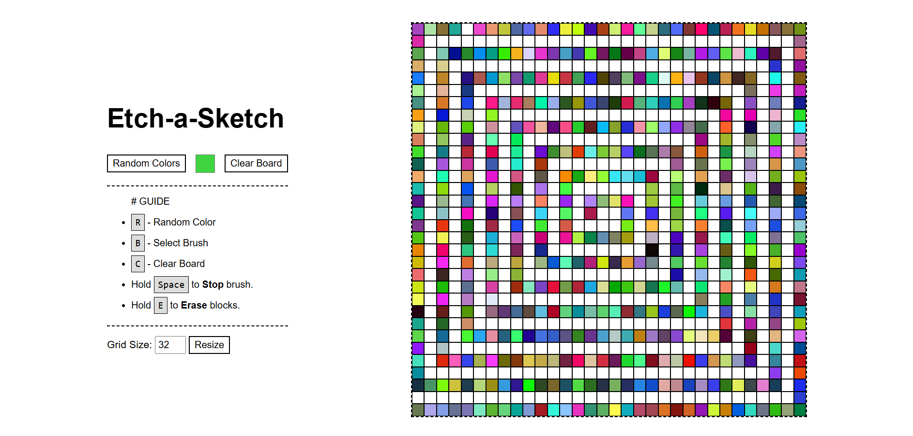

# Mini-Projects

1. Calender - [Mini-Calendar](https://kamal-stark-dev.github.io/Mini-Projects/Calendar/index.html)
2. Color Pallet Generator - [Generator](https://kamal-stark-dev.github.io/Mini-Projects/Color-Pallet-Generator/index.html)
3. Rotating Image Gallery (_One Piece_) - [Image Gallery](https://kamal-stark-dev.github.io/Mini-Projects/Rotating-Image-Gallery/index.html)
4. Etch-a-Sketch - [Start Sketching](https://kamal-stark-dev.github.io/Mini-Projects/Etch-a-Sketch/index.html)
5. Calculator - [Calculate](https://kamal-stark-dev.github.io/Mini-Projects/Calculator/index.html)

# Beginner

1. Button Ripple Effect - [Link](https://kamal-stark-dev.github.io/Mini-Projects/Beginner/Button-Ripple-Effect/index.html)
2. Heart Trail Animation - [Link](https://kamal-stark-dev.github.io/Mini-Projects/Beginner/Heart-Trail-Animation/index.html)
3. Random Images - [Link](https://kamal-stark-dev.github.io/Mini-Projects/Beginner/Random-Images/index.html)
4. Text Animation - [Link](https://kamal-stark-dev.github.io/Mini-Projects/Beginner/Text-Animation/index.html)
5. Character Counter - [Link](https://kamal-stark-dev.github.io/Mini-Projects/Beginner/Real-Time-Character-Counter/index.html)
6. Digital Clock - [Link](https://kamal-stark-dev.github.io/Mini-Projects/Beginner/Digital-Clock/index.html)
7. Loan Calculator - [Calculator](https://kamal-stark-dev.github.io/Mini-Projects/Beginner/Loan-Calculator/index.html)
8. New Year Counter - [Counter](https://kamal-stark-dev.github.io/Mini-Projects/Beginner/Countdown-To-Next-Year/index.html)
9. Drum Kits - [Kit](https://kamal-stark-dev.github.io/Mini-Projects/Beginner/Drum-Kits/index.html)
10. Analog Clock - [Clock](https://kamal-stark-dev.github.io/Mini-Projects/Beginner/Analog-Clock/index.html)
11. Loading Bar - [Loader](https://kamal-stark-dev.github.io/Mini-Projects/Beginner/Loading-Bar/index.html)
12. Mouse Pos - [Get Position](https://kamal-stark-dev.github.io/Mini-Projects/Beginner/Mouse-Pos/index.html)
13. Dice Roll - [Roll Dice](https://kamal-stark-dev.github.io/Mini-Projects/Beginner/Dice-Roll/index.html)
